class: center, middle

.linea-superior[]
.linea-inferior[]


## INE Educa: Clases abiertas de R

## R y herramientas de reproducibilidad

## Proyecto Ciencia de Datos

### Julio 2023

```{r setup, include=FALSE}
options(htmltools.dir.version = TRUE)
knitr::opts_chunk$set(message = FALSE) 
```

```{r xaringan-themer, include=FALSE, warning=FALSE}
library(xaringanthemer)
library(xaringanExtra)
```


```{r xaringanExtra-clipboard, echo=FALSE}
xaringanExtra::use_clipboard()
xaringanExtra::use_panelset()
```

---

background-image: url("imagenes/fondo2.PNG")
background-size: contain;
background-position: 100% 0%

# Bienvenidas y bienvenidos


.center[
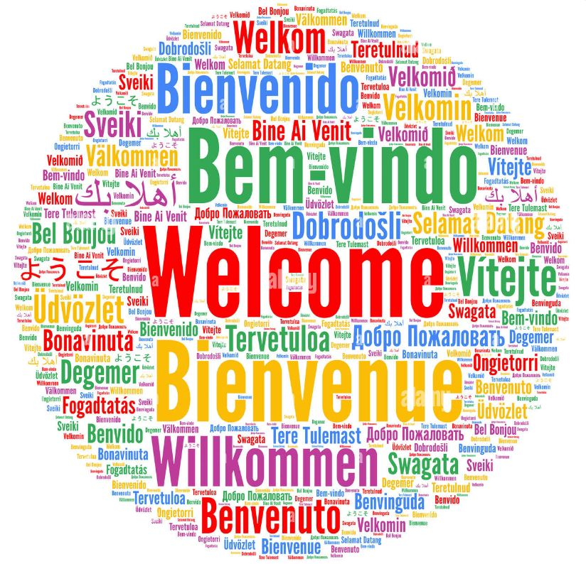
]

---


background-image: url("imagenes/fondo2.PNG")
background-size: contain;
background-position: 100% 0%

# Estructura del taller

##Contenidos de la clase

<br/>

--

- I - Motivación

--

- II - Introducción

--

- III - Rudimentos

--

- IV - Introducción a `renv`

--

- V - Mis proyectos con `renv`

--

- VI - Colaborando con `renv`

--

- VII - Comentarios y referencias
      
<br>
<br>      

---

class: inverse, center, middle

# I. Motivación

---

background-image: url(https://the-turing-way.netlify.app/_images/reproducibility.jpg)
background-size: contain

---

background-image: url("imagenes/fondo2.PNG")
background-size: contain;
background-position: 100% 0%

# Motivación

<br/>
.center[]

---

background-image: url("imagenes/fondo2.PNG")
background-size: contain;
background-position: 100% 0%

# Comentario preliminar

.center[
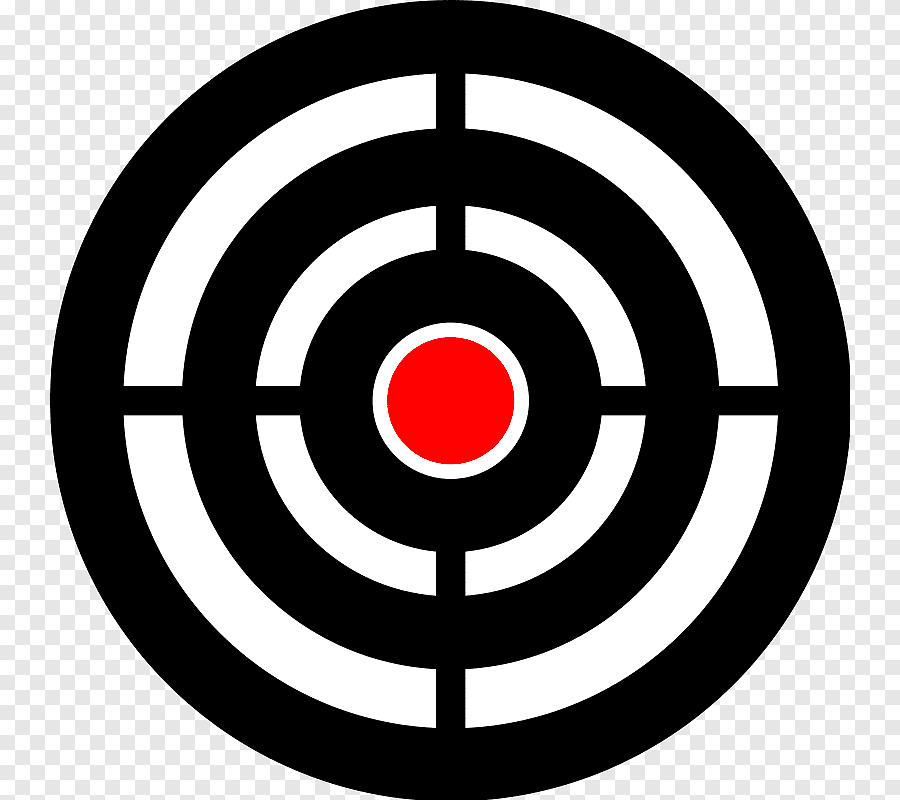
### Público objetivo: orientado a usuarios y usuarias intermedios de R
]

--

**Objetivo del taller:**

- Presentar herramientas para mejorar la reproducibilidad de nuestros flujos de trabajo

.center[**Nota:** mirada desde la **producción de estadísticas oficiales**]

---

class: inverse, center, middle

# II. Introducción

---

background-image: url("imagenes/fondo2.PNG")
background-size: contain;
background-position: 100% 0%

# ¿Qué es la reproducibilidad?

--
<br/>
<br/>
<br/>
<br/>
<br/>
<br/>

.center[.medium-par[Un resultado es .pur[reproducible] cuando los .pur[**mismos pasos**] de análisis realizados en el .pur[**mismo conjunto de datos**] producen consistentemente la .pur[**misma respuesta**]]]


---

background-image: url("imagenes/fondo2.PNG")
background-size: contain;
background-position: 100% 0%

# Reproducibilidad

.panelset[
.panel[.panel-name[Su espectro]

<br/>
<br/>
<br/>


.center[👁️: compartir los datos no es algo trivial]

]


.panel[.panel-name[¿Sus dimensiones?]

.center[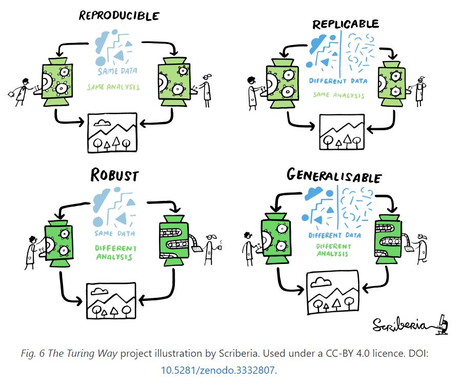]

  ]   
]

---

background-image: url("imagenes/fondo2.PNG")
background-size: contain;
background-position: 100% 0%

# Importancia de la reproducibilidad

--
<br/>

Que .pur[otra persona] (o .pur[mi yo del futuro]) pueda ejecutar mi rutina nuevamente de forma exitosa.

--
<br/>
<br/>

.center[.big-par[**¿Qué puede salir mal?** ⚰️]]

--
<br/>

.center[

]

---

background-image: url("imagenes/fondo2.PNG")
background-size: contain;
background-position: 100% 0%

# 10 years reproducibility challenge

--

.pull-left[
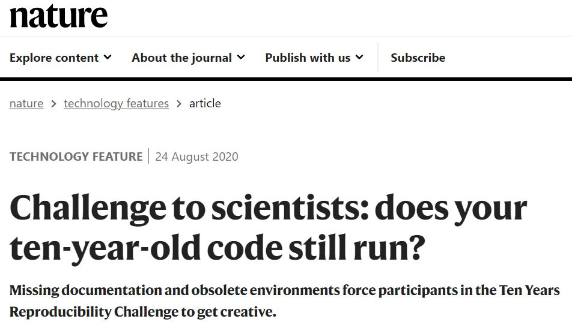

<br/>

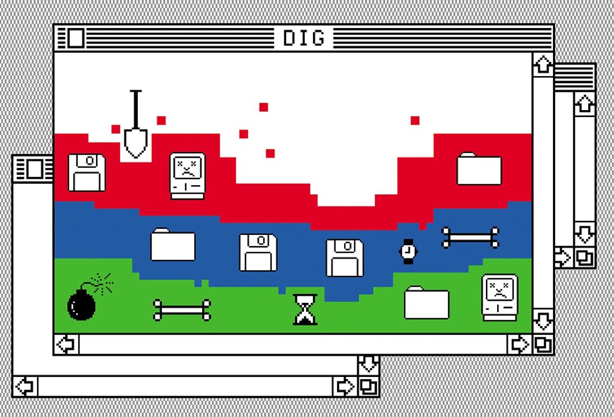
]

--

.pull-rigth[
<br/>
<br/>
&nbsp;&nbsp;&nbsp;&nbsp;&nbsp;&nbsp;&nbsp;&nbsp;&nbsp;&nbsp; 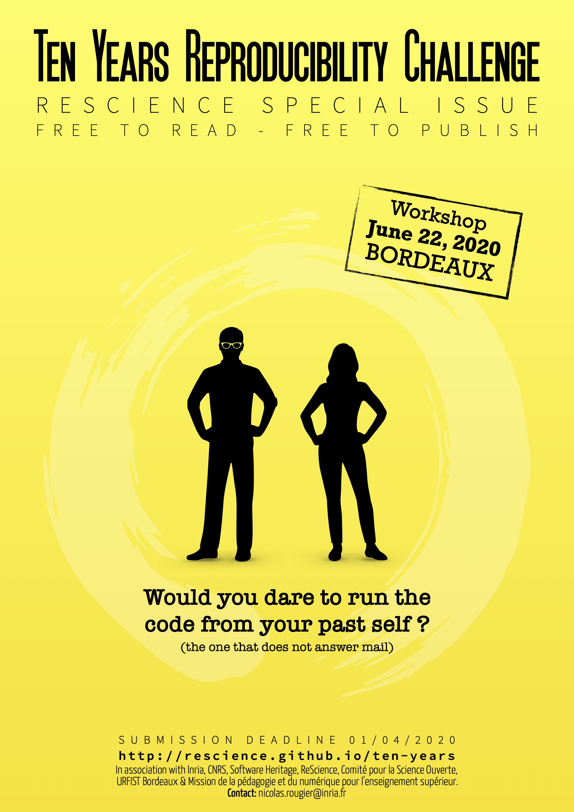
]

---

class: inverse, center, middle

# III. Rudimentos


---

background-image: url("imagenes/fondo2.PNG")
background-size: contain;
background-position: 100% 0%

# El principio: Consola de R

--
<br/>

.medium-par[Utilidades:]

--

Me permite explorar objetos rápidamente con código residual

--

.medium-par[**Desventajas:**]

- Es más complejo desplazarse por distintas líneas de código

--

- No está hecha para almacenar rutinas

--

.medium-par[¿Puedo recuperar el código escrito en consola?]

--

- La verdad es que sí... a través del log de la sesión ("History"), pero es engorroso.

--

.medium-par[.pur[Primer upgrade]: **script**] 

--

El **script** me permite almacenar extensas rutinas de código

---

background-image: url("imagenes/fondo2.PNG")
background-size: contain;
background-position: 100% 0%

# Veamos un ejemplo

--

```{r, echo = F, fig.align = 'center'}
library(dplyr)
library(ggplot2)
library(haven)

# tabla de casen 2020 con selección de variables
{{casen2020 = read_dta("C:/Users/Adm-Ignacio/Documents/Proyectos/clases-abiertas-r/reproducibilidad/data/casen_2020_small.dta")}}

# construcción de variabe de resumen de pobreza
casen2020 = casen2020 %>% 
  mutate(pobreza2 = case_when(pobreza == 1 ~ 1,
                              pobreza == 2 ~ 1,
                              pobreza == 3 ~ 0,
                              is.na(pobreza) ~ 0)) %>% 
  select(region, pobreza2, expr)

# Preparar datos para visualización
tabla = casen2020 %>% 
  group_by(region) %>% 
  summarise(pob_tot = sum(expr),
            pobres = sum(pobreza2 * expr),
            por_pob = round((pobres / pob_tot) * 100,1)) %>% 
  select(-pob_tot, -pobres)

# Plot de personas pobres según región
ggplot(data = tabla, aes(x = as.factor(region), y = por_pob)) + 
  geom_bar(stat = "identity", fill = "orange") + 
  geom_text(aes(label= por_pob, vjust=0)) +
  geom_hline(aes(yintercept = mean(por_pob))) +
  labs(title="Porcentaje de personas pobres por región en Casen 2020",
       x ="Región numérica", y = "Porcentaje") +
  theme(plot.title = element_text(hjust = 0.5))

```

Pueden descargar los datos entrando 👉 [aquí](https://github.com/clases-r-topicos/reproducibilidad/blob/master/data/casen_2020_small.dta) 

---

background-image: url("imagenes/fondo2.PNG")
background-size: contain;
background-position: 100% 0%

# Veamos un ejemplo


```{r, eval=F, echo=T}
library(dplyr)
library(ggplot2)
library(haven)

# tabla de casen 2020 con selección de variables
{{casen2020 = read_dta("C:/Users/Adm-Ignacio/Documents/Proyectos/clases-abiertas-r/reproducibilidad/data/casen_2020_small.dta")}}

# construcción de variabe de resumen de pobreza
casen2020 = casen2020 %>% 
  mutate(pobreza2 = case_when(pobreza == 1 ~ 1,
                              pobreza == 2 ~ 1,
                              pobreza == 3 ~ 0,
                              is.na(pobreza) ~ 0)) %>% 
  select(region, pobreza2, expr)

# Preparar datos para visualización
tabla = casen2020 %>% 
  group_by(region) %>% 
  summarise(pob_tot = sum(expr),
            pobres = sum(pobreza2 * expr),
            por_pob = round((pobres / pob_tot) * 100,1)) %>% 
  select(-pob_tot, -pobres)

# Plot de personas pobres según región
ggplot(data = tabla, aes(x = as.factor(region), y = por_pob)) + 
  geom_bar(stat = "identity", fill = "orange") + 
  geom_text(aes(label= por_pob, vjust=0)) +
  geom_hline(aes(yintercept = mean(por_pob))) +
  labs(title="Porcentaje de personas pobres por región en Casen 2020",
       x ="Región numérica", y = "Porcentaje") +
  theme(plot.title = element_text(hjust = 0.5))
```

.center[.medium-par[¿Qué .pur[obstáculos] a la reproducibilidad podemos observar?]]

---

background-image: url("imagenes/fondo2.PNG")
background-size: contain;
background-position: 100% 0%

# Primeros obstáculos

--
<br/>


.pull-left[

]


--

.pull-right[

- Estoy usando una **ruta absoluta** a los datos

    - rutas absolutas 
    
        - Son propias de mi computador
        
        - Son engorrosas de escribir

    - rutas relativas 

        - 👌 
]

--

.center[.medium-par[.pur[Segundo upgrade:] **Proyectos de R**]]

--

.center[.medium-par[¿Cómo creamos un proyecto?]]


---

background-image: url("imagenes/fondo2.PNG")
background-size: contain;
background-position: 100% 0%

# Ventajas de los proyectos

--
<br/>

- **Organización y gestión:**

    - Organización de archivos y recursos relacionados
    - Estructura clara y fácil acceso a los recursos del proyecto
--

- **Reproducibilidad y control:**

    - Facilita la reproducibilidad de los resultados

--
    
- **Ambiente de trabajo:**

    - Creación de un entorno aislado para cada proyecto

--

- **Colaboración:**

    - Facilidad para compartir y trabajar en equipo
    - rutas relativas -> mayor portabilidad y flexibilidad

---

background-image: url("imagenes/fondo2.PNG")
background-size: contain;
background-position: 100% 0%

# Mención especial 👩‍🎓 / .pur[Upgrade 2.1]

.panelset[
.panel[.panel-name[¿Qué es?]


.pull-left[
<br/>
<br/>


]

.pull-rigth[

- RMarkdown es una versión de Markdown 

- Es un .pur[lenguaje de marcado ligero]

- Permite incorporar código y resultados en un mismo ambiente (`knitr`)

- Es posible usar $LaTex$ dentro de RMarkdown

- Se puede automatizar la generación de documentos en html y pdf

- Muy útil para la reproducibilidad en el .pur[ámbito científico]

]


.panel[.panel-name[¿Qué contiene?]

.center[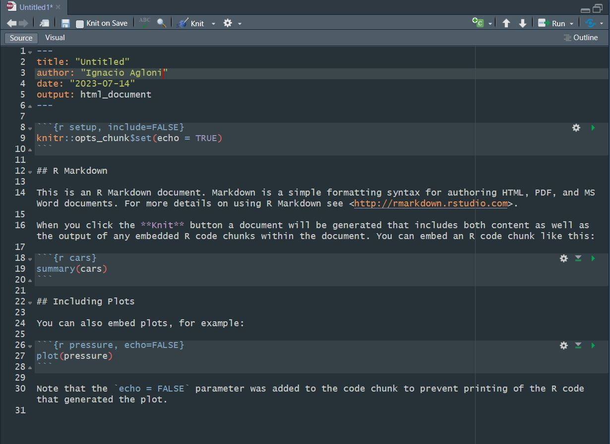]
  ]

.panel[.panel-name[¿Cómo se ve?]
.center[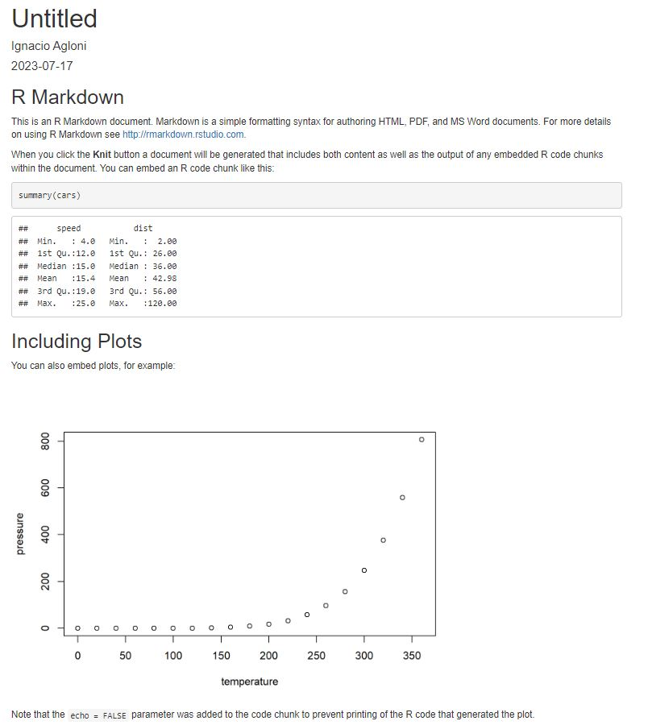]
]

.panel[.panel-name[Algunos ejemplos]

**Documentos:**

[Cálculo de medidas de precisión para medianas de ingreso y gasto de la VIII EPF](https://www.ine.gob.cl/docs/default-source/documentos-de-trabajo/c%C3%A1lculo-de-medidas-de-precisi%C3%B3n-para-medianas-de-ingreso-y-gasto-de-la-v.pdf?sfvrsn=e5b6a7b3_2)

[Métodos de Imputación VIII EPF: Gastos diarios e ingresos de la actividad laboral y jubilaciones](https://www.ine.gob.cl/docs/default-source/documentos-de-trabajo/190320-documento-imputacion-viii-epf.pdf?sfvrsn=668a66c0_2)

**Boletines IPC e IPP:**

.center[

.pull-left[
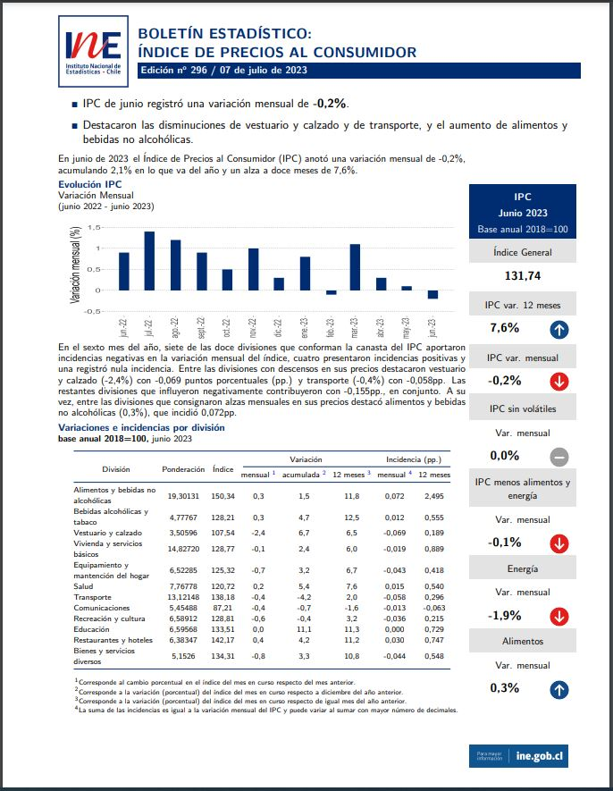
      ]
.pull-rigth[
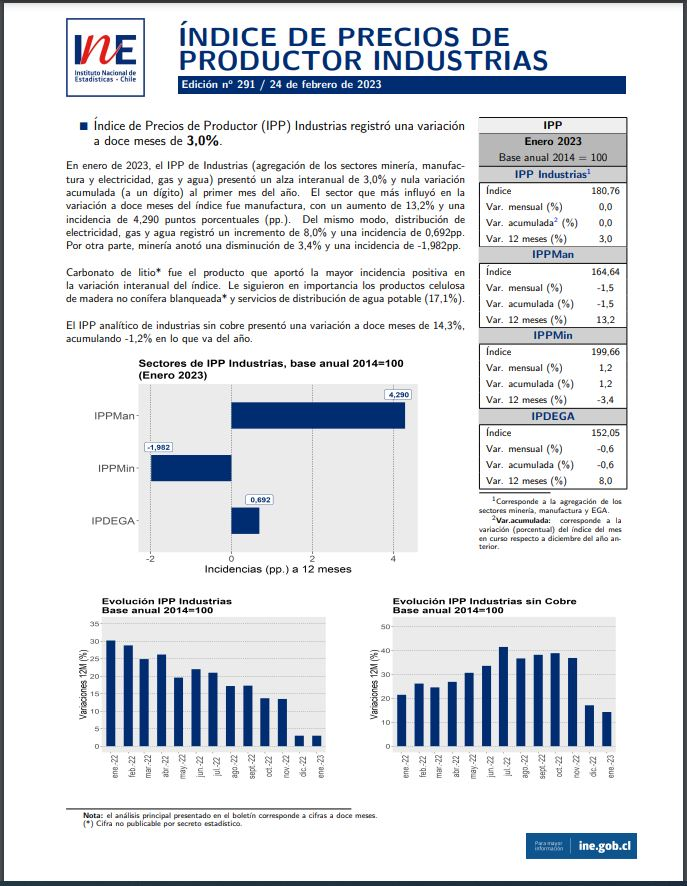]
      ]
    ]
  ]
]

---

class: inverse, center, middle

# IV. Introducción a `renv`

---

background-image: url("imagenes/fondo2.PNG")
background-size: contain;
background-position: 100% 0%

# ¿Qué es `renv`?

--
<br/>
.center[]

--

Es un .pur[gestor de dependencias] locales de `R` 

--

Es el sucesor del paquete `packrat`

--

Busca ofrecer la posibilidad de .pur[guardar] y .pur[restaurar] el estado de la **configuración** de un proyecto en un momento determinado.

--

.center[.medium-par[.pur[Tercer upgrade:] **`renv`**]]

---

background-image: url("imagenes/fondo2.PNG")
background-size: contain;
background-position: 100% 0%

# Crear un entorno con renv

--

Primero que todo

```{r, eval= F}
install.packages("renv")
```

--

Luego hay dos opciones:

--

.pull-left[

- Al crear un proyecto le indicamos que queremos usar renv vía cuadro de diálogo

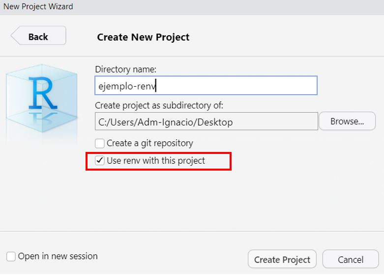

]

--

.pull-right[

- Si queremos iniciar un renv por consola o en un proyecto ya existente

```{r, eval = F}
renv::init()
```
]

--

.center[Esto creará la .pur[infraestructura] de renv en el proyecto]

---

background-image: url("imagenes/fondo2.PNG")
background-size: contain;
background-position: 100% 0%

# Crear un entorno con renv

.panelset[
.panel[.panel-name[¿Qué vemos?]
<br/>

.center[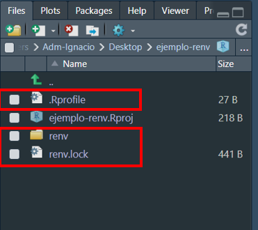]

]

.panel[.panel-name[¿Qué hemos creado?]
<br/>

.pur[.Rprofile:] es un archivo que ejecuta RStudio cada vez que se carga una sesión. Este archivo llama a `renv/activate.R file

.pur[renv/.gitignore:] le dice a Git que **ignore** la carpeta de la biblioteca, ya que contiene dependencias que pueden ser de gran tamaño

.pur[renv/activate.R:] archivo que activa el entorno local

.pur[renv/library/*:] carpeta que contiene las dependencias del proyecto

.pur[renv.lock:] archivo que describe el **estado de la librería de proyecto** en un momento determinado

  ]   
]
---

background-image: url("imagenes/fondo2.PNG")
background-size: contain;
background-position: 100% 0%

# Biblioteca privada

--
<br/>

Cuando le pregunto a `R` donde están las librerías fuera de `renv` veo algo así:

--

```{r, eval = F}
.libPaths()
```

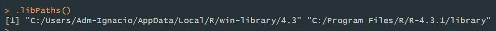

--

Cuando estoy dentro de un ambiente virtual, estoy parado en otro lugar:

--

```{r}
.libPaths()
```
--

👀 Esta clase está hecha en un proyecto de `R` y tiene su propio ambiente virtual

---

background-image: url("imagenes/fondo2.PNG")
background-size: contain;
background-position: 100% 0%

# Flujo de trabajo con `renv`

--
<br/>
<br/>

`renv::init()`: inicia un nuevo ambiente local de proyecto con una librería de R privada

--

`renv::snapshot()`: guarda una "foto" del estado de la librería de proyecto en el `lock.file`

--

`renv::restore()`: restaura el estado de un proyecto desde un `renv.lock`

--

Cuando estoy en un proyecto con un `renv` ya creado:

```{r, eval=F}
renv::activate() # para activar
renv::deactivate() # para desactivar
```


---

background-image: url("imagenes/fondo2.PNG")
background-size: contain;
background-position: 100% 0%

# ¿Cómo funciona `renv`?

.panelset[
.panel[.panel-name[Inicio]

`renv::init()` crea la infraestructura de un ambiente virtual.

Si el proyecto ya existía, .pur[rastrea] y .pur[registra] todas las dependencias en uso

Si la dependencia ya existe en la carpeta de usuario, la tomará desde ahí y no de CRAN

Si prefieres partir de una librería privada vacía y tú poblarla:

```{r, eval = F}
renv::init(bare = TRUE)
```

👀 Lo que gatilla el guardado es que en algún script del proyecto haya un `library(paquete)`. Eso le indica a `renv` que se trata de una .pur[dependencia] del ambiente.
]

.panel[.panel-name[General]
<br/>
.center[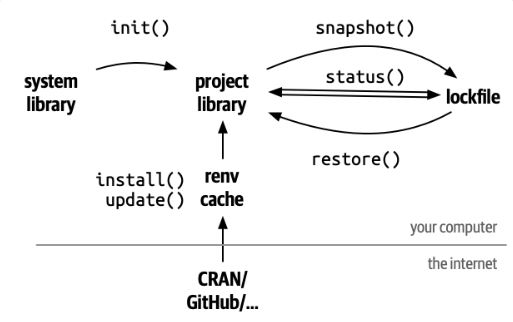]
]

.panel[.panel-name[Cache]

`renv` utiliza un cache de paquetes global compartido por todos los proyectos

De este modo las llamadas a `renv::restore()` y `renv::install()` serán más rápidas

Esto permite ahorrar .pur[espacio en memoria] al evitar la **duplicidad**

.medium-par[enlaces simbólicos o puntos de unión]
]
]

---

class: inverse, center, middle

# V. Mis proyectos con `renv`

---

background-image: url("imagenes/fondo2.PNG")
background-size: contain;
background-position: 100% 0%

# Mis proyectos con `renv`

---

class: inverse, center, middle

# VI. Colaborando con `renv`

---

background-image: url("imagenes/fondo2.PNG")
background-size: contain;
background-position: 100% 0%

# Colaborando con `renv`

---

class: inverse, center, middle

# VII. Comentarios y referencias

---

background-image: url("imagenes/fondo2.PNG")
background-size: contain;
background-position: 100% 0%

# Qué NO soluciona `renv`

<br/>
--

.medium-par[`renv` no es la panacea de la reproducibilidad, es una herramienta más.]

--

`renv` NO ayuda con la versión de `R`, porque se ejecuta dentro de `R`

--

`pandoc` vive fuera del paquete `rmarkdown`

--

Si un paquete ya no está disponible para descarga

--

Para obtener una "imagen" estable se requiere considerar también .pur[sistema operativo] y .pur[aplicaciones del sistema] 

---

background-image: url("imagenes/fondo2.PNG")
background-size: contain;
background-position: 100% 0%

# Mini resumen:

--

No sé si estoy aplicando la misma rutina &nbsp;&nbsp;&nbsp;&nbsp;&nbsp;&nbsp; 👉 &nbsp;&nbsp;&nbsp;&nbsp;&nbsp;&nbsp; .medium-par[.pur[script]]

--

No sé si estoy usando los mismos datos  &nbsp;&nbsp;&nbsp;&nbsp;&nbsp;&nbsp; 👉 &nbsp;&nbsp;&nbsp;&nbsp;&nbsp;&nbsp; .medium-par[.pur[script]]

--

Rutas a archivos que son incorrectas &nbsp;&nbsp;&nbsp;&nbsp;&nbsp;&nbsp;   👉 &nbsp;&nbsp;&nbsp;&nbsp;&nbsp;&nbsp;  .medium-par[.pur[proyectos]]

--

Aleatoriedad no reproducible  &nbsp;&nbsp;&nbsp;&nbsp;&nbsp;&nbsp;  👉  &nbsp;&nbsp;&nbsp;&nbsp;&nbsp;&nbsp;  .medium-par[.pur[set.seed()]], entre otros 

--

Comentarios escuetos en el código  &nbsp;&nbsp;&nbsp;&nbsp;&nbsp;&nbsp;   👉  &nbsp;&nbsp;&nbsp;&nbsp;&nbsp;&nbsp;  .medium-par[.pur[🧐 (estilo de código)]]

--

Variables no localizadas (no creadas en la rutina) &nbsp;&nbsp;&nbsp;&nbsp;   👉 &nbsp;&nbsp;&nbsp;&nbsp;  .medium-par[.pur[RMarkdown]]

--

Diferentes versiones de los paquetes &nbsp;&nbsp;&nbsp;&nbsp;&nbsp;&nbsp;  👉  &nbsp;&nbsp;&nbsp;&nbsp;&nbsp;&nbsp; 
.medium-par[🌱]

--

Diferente versión de *software* o sistema operativo &nbsp;&nbsp;&nbsp;&nbsp;&nbsp;&nbsp;  👉  &nbsp;&nbsp;&nbsp;&nbsp;&nbsp;&nbsp; .medium-par[🐳]

---

background-image: url("imagenes/fondo2.PNG")
background-size: contain;
background-position: 100% 0%

# Caja de herramientas

--
<br/>
.center[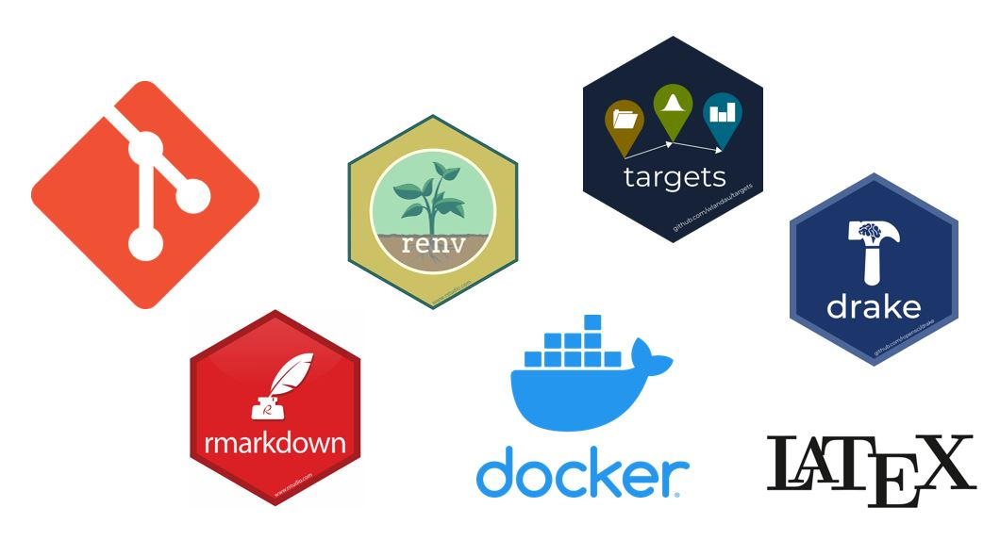]

---

background-image: url("imagenes/fondo2.PNG")
background-size: contain;
background-position: 100% 0%

# Referencias

.medium-par[Nada de esto sería posible sin:]

- [Florencia D'Andrea - meetup de R-Ladies Buenos Aire](https://rladiesba.netlify.app/project/charlar8/)

- [Ciencia Social Abierta - Prof. Juan Carlos Castillo](https://cienciasocialabierta.netlify.app/)

- [Introducción a renv package](https://rstudio.github.io/renv/articles/renv.html)

- [Guía para la reproducibilidad en investigación - The Turing Project](https://the-turing-way.netlify.app/welcome.html)

- [Xaringan: Presentation Ninja, de Yihui Xie](https://github.com/yihui/xaringan). Para generar esta presentación con la plantilla ninja ⚔

- [Advanced R, de Hadley Wickham](http://adv-r.had.co.nz/Introduction.html)

- [Healy, Kieran. 2018. The Plain Person’s Guide to Plain Text Social Science](https://plain-text.co/)

.medium-par[R for Data Science tiene una traducción al español realizada por la comunidad hispana de R:]

- [R para ciencia de datos, de Hadley Wickham](https://es.r4ds.hadley.nz/)

---

class: center, middle

.linea-superior[]
.linea-inferior[]


## INE Educa: Clases abiertas de R

## R y herramientas de reproducibilidad

## Proyecto Ciencia de Datos

### Julio 2023
